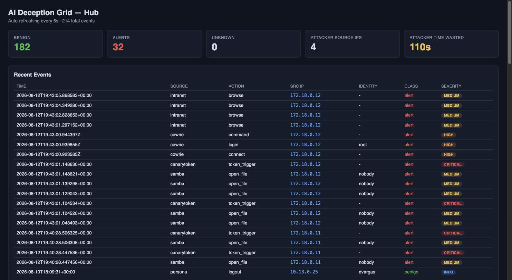
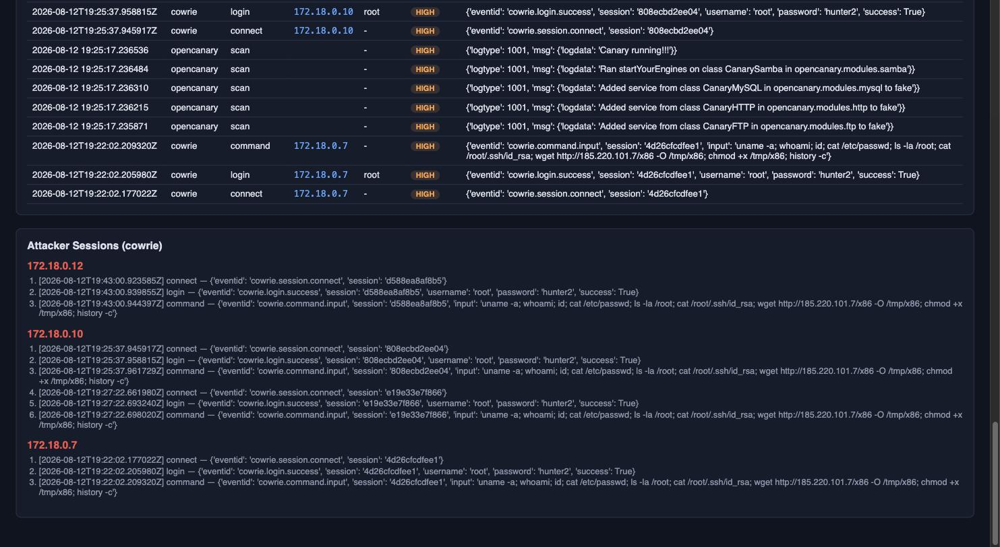

# AI Deception Grid

[](https://github.com/AtharvKashyap/decoyHoneypot/actions/workflows/ci.yml)

An **AI-driven deception lab**: a network of believable decoys and honeypots that
waste attackers' time, detect intrusions with near-zero false positives, and — the
novel part — look *alive* thanks to AI-simulated employees who "work" 9–5, opening,
editing, and sharing files, browsing the intranet, and sending mail.

> **Authorized/defensive use only.** This is a research and blue-team lab meant to
> run on your own isolated network. See [Containment](#containment).



*The live hub dashboard: a clean benign baseline (182 events) with 32 attacker
alerts across the SSH honeypot, multi-service tripwire, SMB exfil, canary trips,
and the AI tarpit — and the attacker's measured time-wasted.*

## Why it's different

Most honeypots are conspicuously empty and static, which tips off skilled attackers.
Here, **simulated personas** generate a realistic benign baseline. That baseline is
what powers detection:

> Personas act from **known accounts, known IPs, on a known schedule**. Anything
> outside that baseline — and *every* touch of a pure trap or canary token — is an
> intruder. High signal, near-zero false positives.

## Architecture

```
Persona Engine ─► decoys (fileserver / intranet / jumphost / mail)  ◄─ Attacker
                  pure traps (cowrie / opencanary / canary tokens)
                        │  events
                        ▼
        Collector ─► SQLite event store ─► Detection ─► Dashboard (:8000)
```

| Component      | Role                                                             | Built on            |
|----------------|-----------------------------------------------------------------|---------------------|
| `generator/`   | AI-generates the fake org + document contents (offline fallback)| Claude / templates  |
| `personas/`    | Behavior engine: simulated employees on a schedule              | APScheduler         |
| `hub/`         | Ingest + detection + dashboard                                  | FastAPI + SQLite    |
| `traps/`       | Honeypots & decoy services (+ log forwarders → hub)             | Cowrie, OpenCanary, Samba, Mailpit |
| `engagement/`  | AI tarpit: serves believable fake content to waste attacker time| Claude / templates  |
| `core/`        | Shared event schema + config contract                          | stdlib + PyYAML     |

Live detection covers all of it: the Cowrie SSH honeypot and OpenCanary tripwires
forward every hit; the Samba fileserver audits file reads so **exfiltration and
canary-token trips appear on the dashboard in real time**; and the AI tarpit logs
each time it lures an intruder deeper.

### Detection & response features

- **Kill-chain correlation** — the hub groups each attacker's activity into an
  ordered story tagged with **MITRE ATT&CK** tactics/techniques (recon → discovery
  → collection → exfil → access → execution). See the dashboard panel or
  `GET /api/killchains`.
- **Real canary callbacks** — canaried documents embed a tracking URL and ship a
  companion `*.beacon.html`; opening it hits `GET /canary/<token>` on the hub and
  fires a **critical** alert — the classic canary-token mechanism (works even when
  the file is opened off-network).
- **SOC alerting** — high/critical alerts are pushed to a webhook (`ALERT_WEBHOOK`,
  Slack-aware) and/or syslog (`ALERT_SYSLOG`); unset by default (no-op).
- **Live persona traffic** — personas generate real SMB/HTTP/SMTP/SSH traffic and
  authenticate to the fileserver as a shared `employee` account, so the audit
  forwarder cleanly separates them from the anonymous attacker (no double-counting).

## Quick start (no Docker, no API key needed)

```bash
make install      # venv + deps
make test         # unit tests
make demo         # offline end-to-end: generate -> personas -> attacker -> detect
make dash         # view the dashboard at http://localhost:8000
```

## Full lab (Docker)

```bash
cp .env.example .env      # optionally add ANTHROPIC_API_KEY
make generate             # build the fake org + seed documents
make lab                  # docker compose up the whole deception grid
make attack               # run a REAL red-team kill-chain against the live lab
# open http://localhost:8000 to watch it land, then:
make lab-down
```

`make attack` builds a small red-team toolbox image (nmap, ssh, smbclient) and
runs it *on* the sealed deception network, executing a real kill-chain:
port-scan → SMB discovery/exfil of canaried docs → OpenCanary tripwire probes →
brute-force into the Cowrie SSH honeypot and run a recon session. The honeypots'
forwarders relay every interaction to the hub, where it lands as alerts against
the persona baseline. `personas` (auto-started by `make lab`) supplies the
benign 9–5 traffic, so the dashboard shows the same benign-vs-alert split as the
offline demo — but from live containers.



*Session replay: the hub reconstructs each intruder's Cowrie session by source IP,
showing the exact commands they ran in the fake shell — real capture from the live
red-team run.*

## Runs anywhere

- **App layer** (generate / personas / hub / detection / offline demo) is pure
  Python — Linux, macOS, and Windows, Python 3.11/3.12. CI runs the suite on all
  three OSes.
- **Container lab** uses multi-arch images only (Cowrie, Mailpit, Samba, Alpine,
  `python:slim`), so it runs natively on both `amd64` and `arm64` (Apple Silicon)
  with no emulation.
- CI (`.github/workflows/ci.yml`) additionally spins up the honeypot + hub in
  Docker, runs the live attacker, and asserts the alert reaches the hub.

## Testing & demo playbook

**Fast path — no Docker, no API key:**

```bash
make install && make test     # 67 unit tests
make demo                     # generate → 9-5 personas → attacker → detect → kill chain
make dash                     # dashboard at http://localhost:8000
```

**Full live lab, then drive a real attacker:**

```bash
make generate                 # AI/offline fake org + seeded canaried docs
make lab                      # 11 containers (honeypots, decoys, hub, personas, tarpit)
make attack                   # real nmap/ssh/smbclient kill-chain on the sealed network
open http://localhost:8000    # watch benign baseline vs. alerts light up
```

**Exercise each capability directly:**

```bash
# Kill-chain correlation (MITRE ATT&CK):
curl -s localhost:8000/api/killchains | python3 -m json.tool

# Canary HTTP callback — open a beacon (fires a CRITICAL trip):
TOKEN=$(grep -o 'canary/[0-9a-f-]*' seed/generated/it/passwords.xlsx.beacon.html | cut -d/ -f2)
curl -s "localhost:8000/canary/$TOKEN" -o /dev/null -w '%{http_code}\n'

# SOC alerting — point at any webhook and trigger an alert:
ALERT_WEBHOOK=https://hooks.slack.com/services/XXX docker compose up -d hub

# Identity mapping — authenticated employee is benign, anonymous guest alerts:
docker run --rm --network decoyhoneypot_deception --entrypoint smbclient deception-attacker \
  //fileserver/company -U employee%labpass -c 'get "it/passwords.xlsx" /dev/null'   # skipped
docker run --rm --network decoyhoneypot_deception --entrypoint smbclient deception-attacker \
  //fileserver/company -N -c 'get "it/passwords.xlsx" /dev/null'                    # ALERT

make lab-down                 # tear it all down
```

## Containment

- The `deception` Docker network is `internal: true` — **no egress**. Decoys and
  traps cannot reach the internet or pivot outward.
- Only the hub publishes a port (the dashboard). Nothing else is exposed.
- Everything is synthetic: no real credentials, no real data.

## Layout

See `docs/superpowers/specs/2026-08-12-ai-deception-grid-design.md` for the full design.
